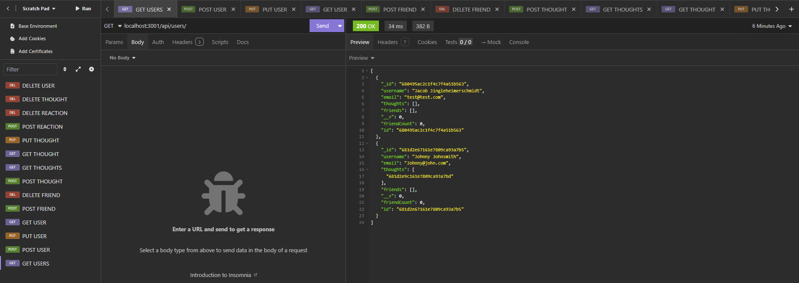

# README
  ;

  ## Description

  A simple social media API allowing users to create, display, edit, and delete profiles, add and delete friends, create, display, edit, and delete thoughts, and add and delete reactions to thoughts.

  

  ## Table of Contents

  - [Installation](#installation})
  - [Usage](#usage)
  - [License](#license)
  - [Contributing](#contributing)
  - [tests](#tests)
  - [Questions](#questions)

  ## Installation

  Install all dependencies with npm install and build and run the server using npm start.

  ## Usage
  Once the server is built and started a user can use insomnia to make HTTP requests. The server accepts post, get, put and delete requests for users. Once one or more users is added, the user may get all users, or get/put/delete a user by ID. They may also add or delete a friend using user IDs, and add, edit, view, and delete thoughts and reactions in a similar manner.

  Please refer to the walkthrough video linked below or the files located in src/routes for API routes. The application currently does not feature any GUI or client.

  [Video_Walkthrough](https://www.loom.com/share/9f60d4c6fd584fb2bc1a70639b42ed75?sid=35675925-07c7-4382-a981-a98320316451)

  ## Apache 2.0 License

  Copyright 2025 Jacob Peterson

        Licensed under the Apache License, Version 2.0 (the "License");
        you may not use this file except in compliance with the License.
        You may obtain a copy of the License at

        http://www.apache.org/licenses/LICENSE-2.0

        Unless required by applicable law or agreed to in writing, software
        distributed under the License is distributed on an "AS IS" BASIS,
        WITHOUT WARRANTIES OR CONDITIONS OF ANY KIND, either express or implied.
        See the License for the specific language governing permissions and
        limitations under the License.

  https://www.apache.org/licenses/LICENSE-2.0

  ## Contributing

  N/A

  ## Tests

  N/A

  ## Questions

  For questions please contact us at https://github.com/Jpeterson1118 or at peterson.jacob13@protonmail.com.

